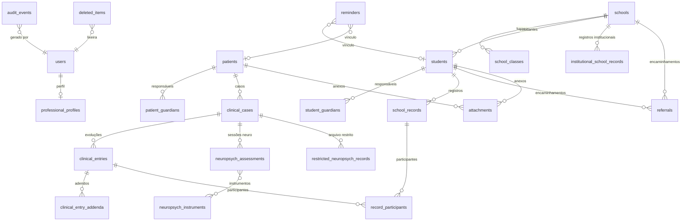

# Modelo de dados — PsicoRegistro

Banco: **SQLite** local (`%APPDATA%/br.com.psicoregistro.app/psicoregistro.db`), WAL, `foreign_keys=ON`.

## Convenções

- **PK** `id TEXT` — UUID v4.
- **Datas** em ISO 8601 (UTC) nas colunas `created_at`, `updated_at`; exibição em pt-BR.
- **Exclusão lógica** via `deleted_at TEXT NULL`.
- **Campos sensíveis** não ficam em texto puro: cada entidade tem `data_enc BLOB` com o JSON dos campos sensíveis cifrado (XChaCha20-Poly1305). Só colunas estruturais (FKs, status, tipos, datas de filtro) ficam em claro, para permitir índices e integridade.
- `is_demo INTEGER` marca dados de demonstração.
- Consultas sempre parametrizadas; nomes de tabela/coluna passam por allowlist no Rust.

## Diagrama (entidade-relacionamento)

## Tabelas

### Núcleo / segurança
| Tabela | Colunas em claro | Conteúdo cifrado (`data_enc`) |
|---|---|---|
| `users` | `password_phc`, `kdf_salt`, `wrapped_key`, `failed_attempts`, `locked_until` | — (envelope de chave; sem PII) |
| `app_settings` | `key`, `value` | preferências não sensíveis (tema, fonte, último backup) |
| `professional_profiles` | — | nome, CRP, contato, instituição, logotipo |
| `audit_events` | `event_type`, `entity_kind`, `entity_id`, `detail`, `created_at` | — (apenas metadados) |
| `deleted_items` | `entity_kind`, `entity_id`, `deleted_at`, `purged_at` | — |
| `database_migrations` | `version`, `applied_at` | — |

### Prontuário clínico
| Tabela | Colunas em claro | Cifrado |
|---|---|---|
| `patients` | `status` | nome, nome social, nascimento, CPF, contatos, endereço, ocupação, responsáveis, observações |
| `patient_guardians` | `patient_id` | nome, relação, telefone |
| `clinical_cases` | `patient_id`, `case_type`, `status`, `start_date`, `end_date` | demanda, origem, objetivos, contexto, modalidade, frequência, encerramento |
| `clinical_entries` | `case_id`, `entry_type`, `status`, `entry_date`, `followup_date` | todos os campos de evolução (comuns + específicos por tipo) |
| `clinical_entry_addenda` | `entry_id` | motivo, conteúdo do adendo |
| `neuropsych_assessments` | `case_id`, `stage`, `status`, `session_date` | objetivos, informantes, achados (uso reservado; sessões usam `clinical_entries`) |
| `neuropsych_instruments` | — | catálogo de instrumentos (metadados, sem itens de teste) |
| `restricted_neuropsych_records` | `case_id`, `applied_date` | instrumento, edição, escores e classificações digitados, observações técnicas |

### Psicologia escolar
| Tabela | Colunas em claro | Cifrado |
|---|---|---|
| `schools` | `status`, `network` | nome, INEP, endereço, contatos, direção, coordenação, turnos |
| `school_classes` | `school_id` | nome da turma, turno |
| `students` | `school_id`, `status`, `grade`, `shift` | nome, nascimento, matrícula, professor, responsáveis, demanda |
| `student_guardians` | `student_id` | nome, relação, contatos |
| `school_records` | `student_id`, `school_id`, `activity_type`, `status`, `record_date`, `followup_date`, `restriction_level` | situação, objetivo, ações, orientações, contatos, participantes |
| `institutional_school_records` | `school_id`, `record_type`, `record_date` | público, participantes, demanda, objetivo, atividade, resultados |
| `record_participants` | `record_id`, `record_kind` | nome, função, meio de contato, combinações |
| `referrals` | `student_id`, `school_id`, `status`, `referral_date`, `area`, `next_check_date` | destino, motivo, comunicação, retorno, resultado |

### Suporte
| Tabela | Colunas em claro | Cifrado |
|---|---|---|
| `reminders` | `due_date`, `status`, `reminder_type`, `priority`, `linked_kind`, `linked_id` | título, descrição administrativa |
| `attachments` | `owner_kind`, `owner_id`, `ext`, `size_bytes`, `hash`, `restricted` | nome original (blob do arquivo cifrado em `attachments/<id>.bin`) |
| `exports` | `export_type`, `target_kind`, `target_id` | — |

## Índices

`idx_cases_patient`, `idx_entries_case`, `idx_entries_date`, `idx_students_school`,
`idx_srecords_student`, `idx_srecords_date`, `idx_referrals_student`, `idx_referrals_status`,
`idx_reminders_due`, `idx_attach_owner`, `idx_audit_created`.

## Migrações

Versionadas em `database_migrations`. A migração `0001_initial` cria as tabelas de núcleo; as tabelas de entidade são criadas idempotentemente a cada inicialização (DDL derivada de `db::TABLES`). Novas alterações de esquema devem ser adicionadas como novas entradas em `MIGRATIONS` (`src-tauri/src/db.rs`).
